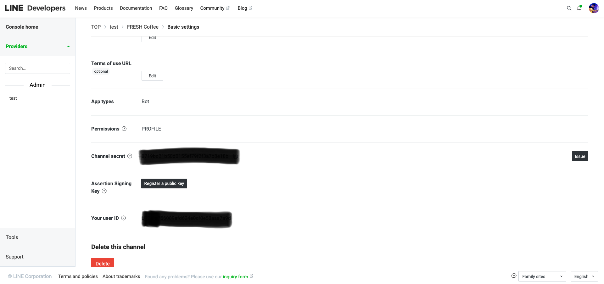
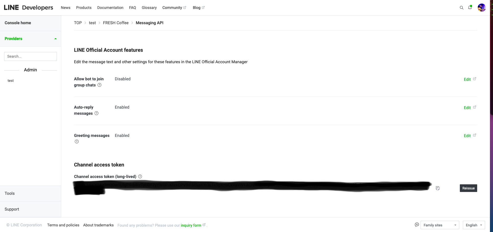

# fresh-coffee

#### This project aims to create a LINE chatbot which is able to order coffee automatically using LINE message API.  

> **channel access token**, **channel secret** and **user id** can be accessed while creating a line developer account
> 
>
> 

#### This project is constructed mainly using Line Message API (both replyMessage API and pushMessageAPI)

#### The backend framework is express.js, which is a framework based on node.js runtime environment

#### Also, I set up a local server using ngrok and paste the url to webhookurl

```sh
ngrok http 3000
```

#### First, install **@line/bot-sdk** and **express** using npm

```sh
npm install express
npm install @line/bot-sdk
```

#### Second, set up the backend environment with the below code

```js
const express = require("express");
const line = require("@line/bot-sdk");
const app = express();

const config = {
  channelAccessToken: YOUR_CHANNEL_ACCESS_TOKEN,
  channelSecret: YOUR_CHANNEL_TOKEN,
};
const client = new line.Client(config);
```

#### Lastly, using express router and LINE API's middleware to enable the chatbot to handle the request message you sent and response to you.

```js
app.post("/webhook", line.middleware(config), (req, res) => {
  Promise.all(req.body.events.map(handleEvent))
    .then((result) => res.json(result))
    .catch((err) => {
      console.error(err);
      res.status(500).end();
    });
});
```

#### Remember to listen to the 3000 port inorder to let **ngrok** work

```js
app.listen(3000, () => {
  console.log(`Server is listening on port 3000`);
});
```
